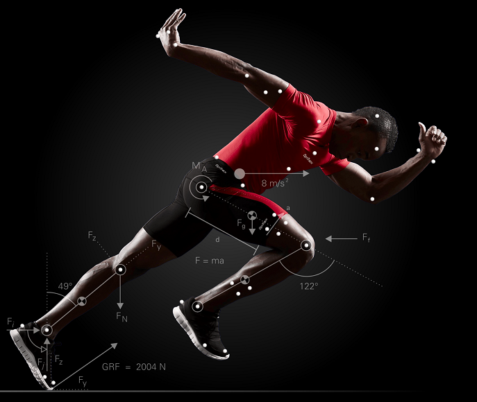
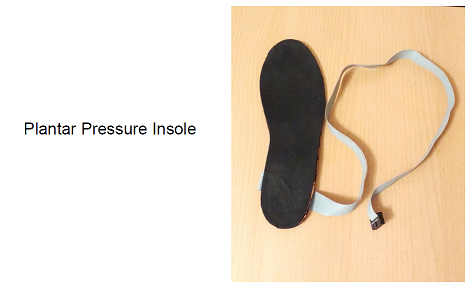
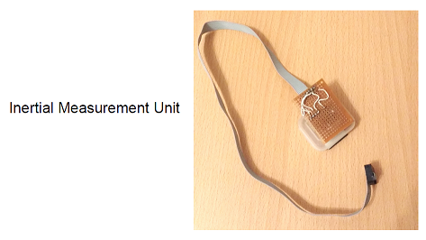

# Welcome to our Project

## Wearable-Sensor-Systems-Development-for-Gait-Analysis
Gait analysis is a systematic evaluation of human motion, and serves as an important medical diagnostic process which has many end user applications in healthcare, rehabilitation therapy and exercise training. The technology supporting the analysis of human motion has advanced over time. However conventional gait analysis must be performed in a gait laboratory, which is costly and hence inaccessible to most people, and also cannot provide gait measurement in a natural terrain. In recent years, demand for wearable sensor systems for the purpose of gait analysis has taken a huge leap as a cost-effective technology and has also shown promising results.

This project is aimed at presenting a wearable sensor platform for gait data acquisition and analysis. The first sensor system includes an in-shoe plantar pressure sensor insole and inertial measurement units. The in-shoe system includes a sensorized insole with a piezo resistive material. Key features of this insole include good working pressure range, cost effectiveness, real time data visualization and data acquisition for an intuitive understanding of plantar pressure distribution. 

The second sensor system involves inertial measuring units for body segment and joint angle estimation in the context of human motion analysis. The main focus is on angle estimation methods that use only accelerometers and gyroscopes and therefore do not rely on homogenous magnetic fields. 

The estimated angles of the gait trails are validated with an optical reference system using Kinovea. Data acquisition includes a set of experiments of real life scenarios like sitting and standing postures, hallway walking from which gait parameters and features are extracted. Finally, the work is concluded with estimation of gait parameters which include gait phase events, body segment orientation, joint angle and temporal parameters like stride time, step time, cadence, stance time, swing time etc.
